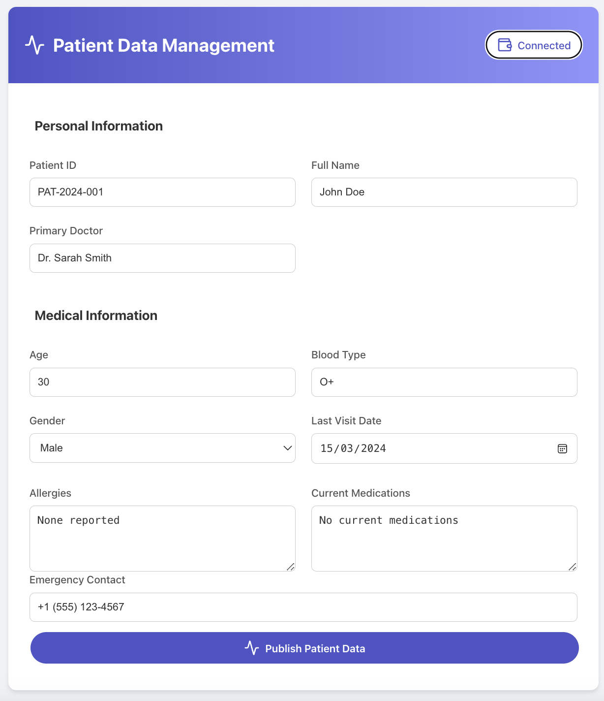
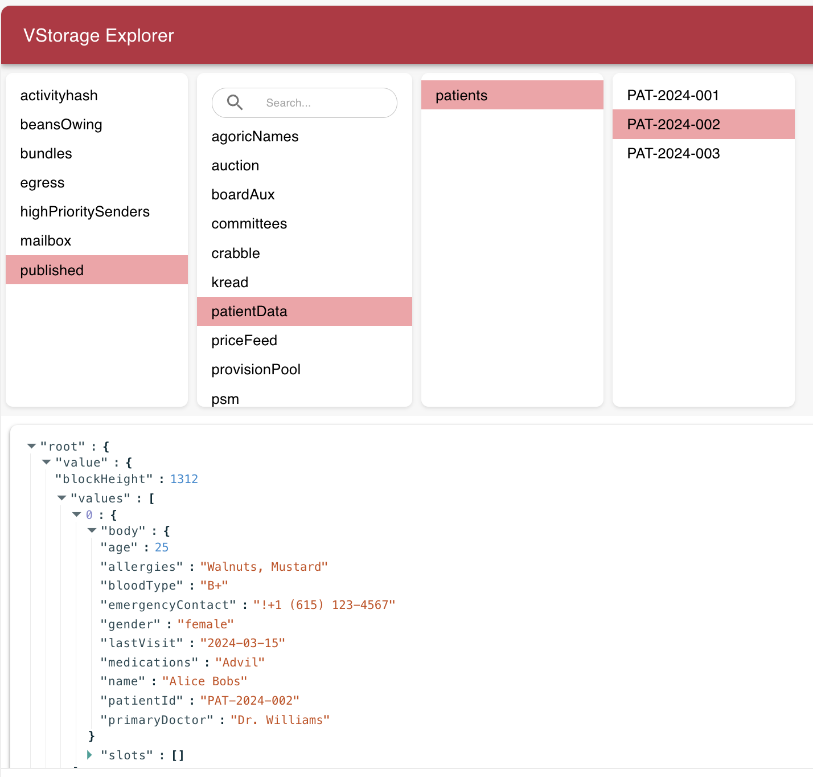

# Agoric Dapp Starter: Med Rec

Med Rec is a simple Dapp for the [Agoric smart contract platform](https://docs.agoric.com/) that permits users to add medical records, in particular patient data, to Agoric blockchain. Users are given a simple in which to enter patients personal and medical information, and upon successful completion, this data is added to the Agoric VStorage. Currently, users can arbitrary number of patient's records.
Note that this is an example dapp with no consideration made for privacy of sensitive information. All entered data maybe publicly visible depending on the host network of this dapp.
This is the user interface of dapp:
<p align="center">
    
</p>

This is how the data looks like in VStorage:
<p align="center">
    
</p>

## Getting started

Detailed instructions regarding setting up the environment for Agoric dapps with a video walkthrough is available at [Your First Agoric Dapp](https://docs.agoric.com/guides/getting-started/) tutorial. But if you have the environment set, i.e., have correct version of node, yarn, docker, and Keplr wallet installed, here are the steps that you need to follow:
- run the `yarn install` command to install any solution dependencies. *Downloading all the required dependencies may take several minutes. The UI depends on the React framework, and the contract depends on the Agoric framework. The packages in this project also have development dependencies for testing, code formatting, and static analysis.*
- start a local Agoric blockchain using the `yarn start:docker` command.
- run `yarn docker:logs` to check the logs. Once your logs resemble the following, stop the logs by pressing `ctrl+c`.
```
demo-agd-1  | 2023-12-27T04:08:06.384Z block-manager: block 1003 begin
demo-agd-1  | 2023-12-27T04:08:06.386Z block-manager: block 1003 commit
demo-agd-1  | 2023-12-27T04:08:07.396Z block-manager: block 1004 begin
demo-agd-1  | 2023-12-27T04:08:07.398Z block-manager: block 1004 commit
demo-agd-1  | 2023-12-27T04:08:08.405Z block-manager: block 1005 begin
demo-agd-1  | 2023-12-27T04:08:08.407Z block-manager: block 1005 commit
```
- run `yarn start:contract` to start the smart contract. 
- run `yarn start:ui` to start the smart contract. You can use the link in the output to load the smart contract UI in a browser.

## Contributing

See [CONTRIBUTING](./CONTRIBUTING.md) for more on contributing to this repo.
